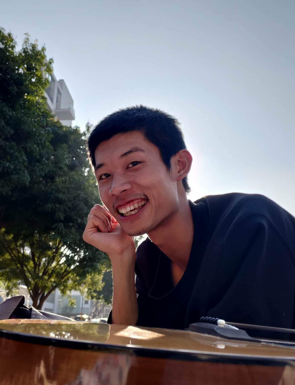
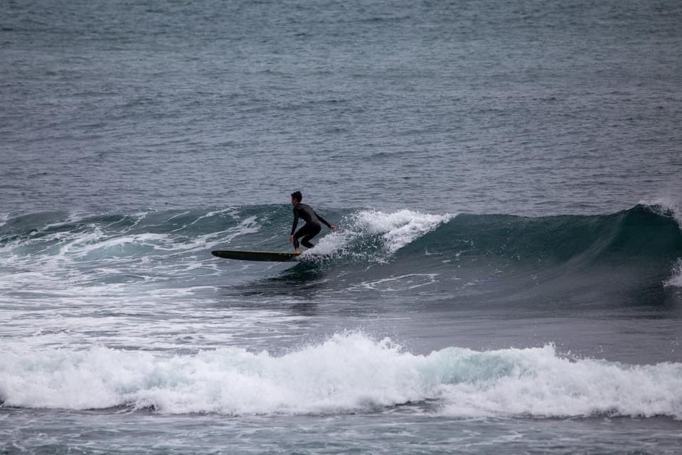
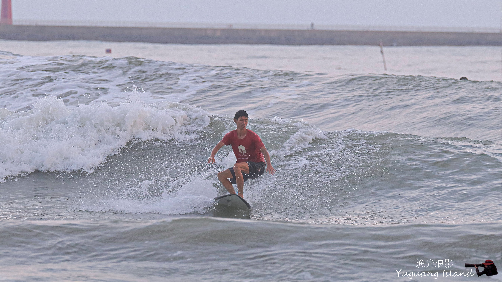
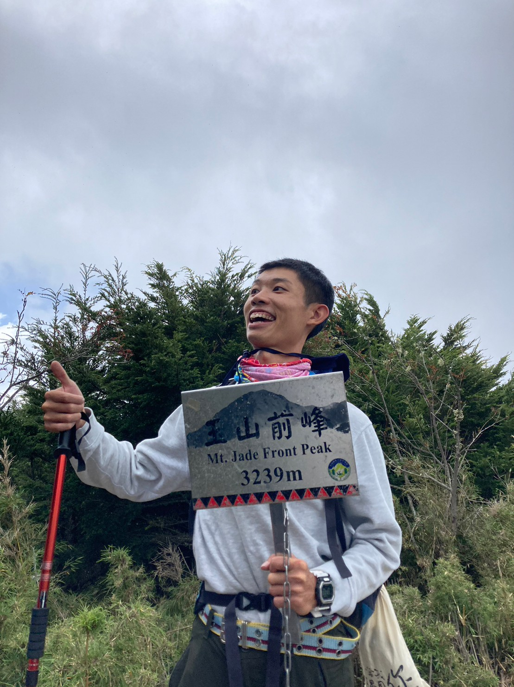
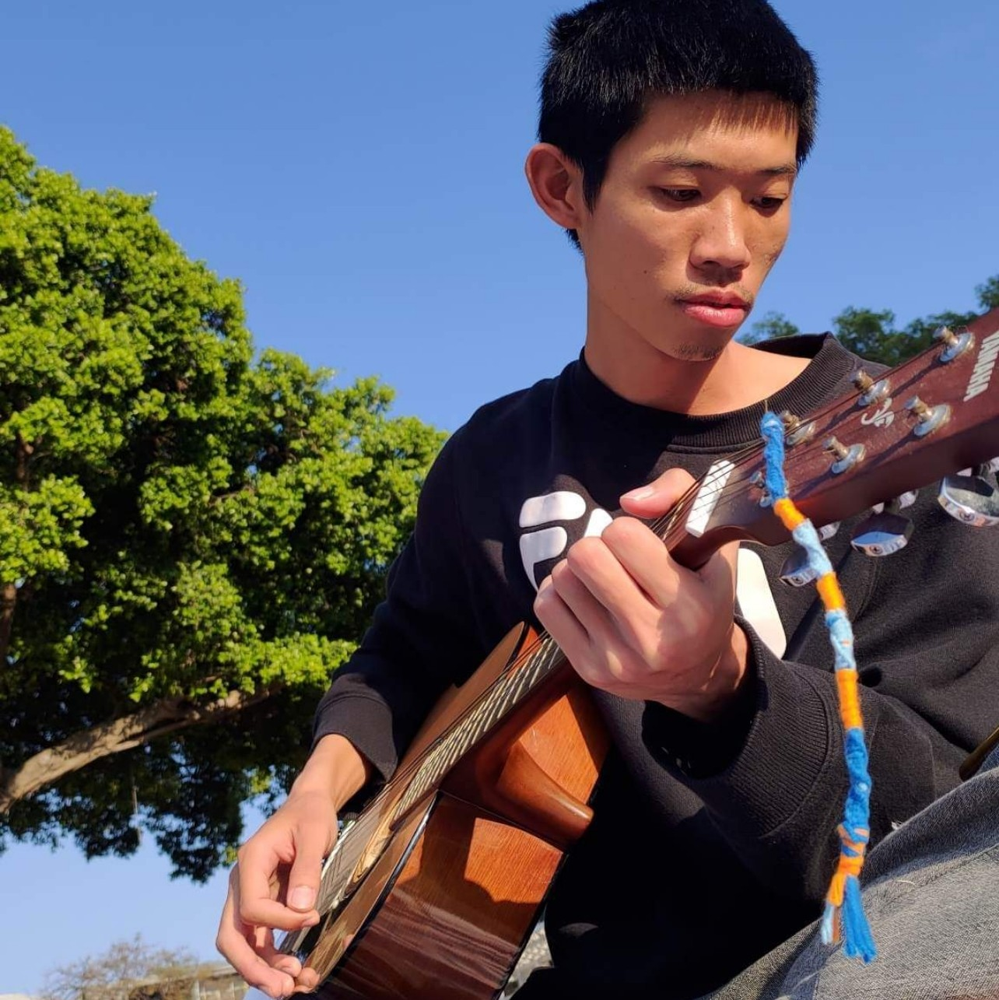

<!-- Who are you and what you do. -->

Modi is a software developer who is passionate about 
turning ideas into workable prototypes. 
He has been coding since 2015. He started 
with C++ and then gradually learn other
programming languages such as Python, Dart, TypeScript, and Go.
He studied natural language processing during his master degree
and he worked on incorporating human thinking framework into
large language models like GPT-4 as his master thesis.
Modi was inspired by Design Thinking
methodology and believed that only if you have empathy
toward your user can you build a great product.

<figure>
  
  <figcaption style="text-align: center;">
    Photo by my good friend Sara.
  </figcaption>
</figure>

<!-- Talk about the intrests. -->

Aside from work, Modi enjoys surfing with friends, his favorite
surf spot is in Taitung, Taiwan and hopes one day he get to
take a surf trip to Bali.

<figure>
  
  <figcaption style="text-align: center;">
    Surfing at Wushi Harbor (North), Yilan, Taiwan.
  </figcaption>
</figure>
<figure>
  
  <figcaption style="text-align: center;">
    Surfing at Yuguang Island, Tainan, Taiwan.
  </figcaption>
</figure>

Modi loves to explore the nature and likes to go camping,
river tracing and hiking.

<figure>
  
  <figcaption style="text-align: center;">
    Mt. Jade Front Peak, my first 100 Peaks of Taiwan.
  </figcaption>
</figure>

Modi also likes to play guitar. Inspired
by Jazz improvisation, Modi believed that music is a interactive and
creative experience, so he encourage people improvise when they play
together.

<figure>
  
  <figcaption style="text-align: center;">
    Photo by my good friend Sara. We were having a 
    good afternoon playing music together.
  </figcaption>
</figure>
